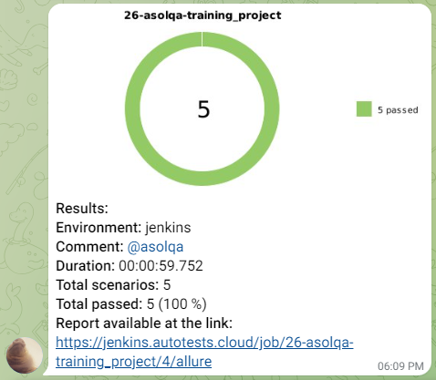

# Training project for test automation of [AskMask.ru](http://askmask.ru)

---

AskMask is a large online store for Asian cosmetics and official distributor for top Korean and Japanese 
brands in Russia

<a href="http://askmask.ru"></a>

---

## Content:

- <a href="#tools">Tools and technologies</a>
- <a href="#scenarios">Test scenarios</a>
- <a href="#jenkins">CI/CD with Jenkins</a>
- <a href="#cli">Запуск из терминала</a>
- <a href="#allure">Allure reporting</a>
- <a href="#allure-testops">Integration with Allure TestOps</a>
- <a href="#jira">Integration with JIRA</a>
- <a href="#telegram">Bot notifications in Telegram</a>
- <a href="#video">Examples of test execution</a>


<a id="tools"></a>
## Tools and technologies:
<p align="center"> 
<a href="https://www.jetbrains.com/idea/"></a>  
<a href="https://www.java.com/"></a>  
<a href="https://github.com/"></a>  
<a href="https://junit.org/junit5/"></a>  
<a href="https://gradle.org/"></a>  
<a href="https://selenide.org/"></a>  
<a href="https://aerokube.com/selenoid/"></a>  
<a href="https://github.com/allure-framework/allure2"></a>
<a href="https://qameta.io/"></a>   
<a href="https://www.jenkins.io/"></a>  
<a href="https://www.atlassian.com/ru/software/jira/"></a>
</p>

<a id="scenarios"></a>
## Test Scenarios
* [x] Verify main page elements
* [x] Verify official brands are shown in the main menu
* [x] Verify contact page contains actual information
* [x] Verify subscription is available 
* [x] Verify search works as expected
* [x] Verify blog page contains article about niacinamide
* [x] Verify basket is empty on very first opening website

<a id="jenkins"></a>
## </a><a name="CI/CD with Jenkins"></a>CI/CD with [Jenkins](https://jenkins.autotests.cloud/job/26-asolqa-training_project/)</a>

### **Jenkins parameters:**

- *task (all tests will be launched by askmask_smoke_test by default)*
- *browser (browser, chrome by default)*
- *browserVersion (version of browser, 120 by default)*
- *browserSize (browser windows size, 1920x1080 by default)*
- *wdHost (login, password and URL of remote Selenoid server)*

<a id="cli"></a>
## Launch from the CLI

***Local launch:***
```bash  
gradle clean askmask_smoke_test
```

***Remote Jenkins launch:***
```bash  
clean ${TASK}
"-Dbrowser=${BROWSER}"
"-DbrowserVersion=${BROWSER_VERSION}"
"-DbrowserSize=${BROWSER_SIZE}"
"-DwdHost=${WD_HOST}"
```

<a id="allure"></a>
## </a> <a name="Allure"></a>Allure [reporting](https://jenkins.autotests.cloud/job/Kod3ik_qa_guru_x5/allure/)</a>


<a id="allure-testops"></a>
## </a> Integration with <a target="_blank" href="https://allure.autotests.cloud/project/4206/dashboards">Allure TestOps</a>

<a id="jira"></a>
## </a> Integration with с <a target="_blank" href="https://jira.autotests.cloud/browse/HOMEWORK-1202">Jira</a>

<a id="telegram"></a>
## </a> Bot notifications in Telegram
 


